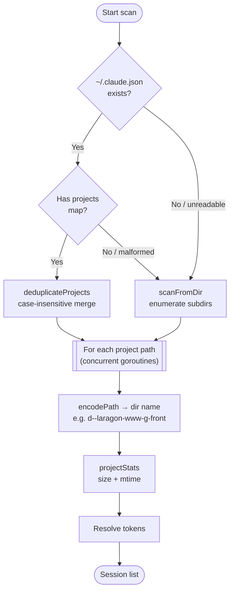
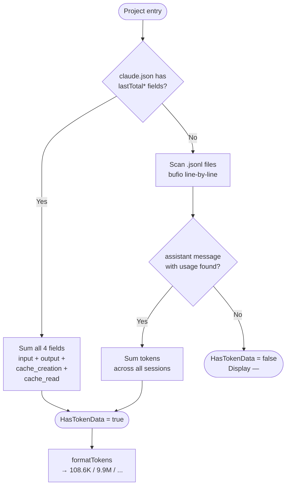

# Architecture

## Session discovery

```mermaid
flowchart TD
    A([Start scan]) --> B{"~/.claude.json\nexists?"}
    B -- Yes --> C{"Has projects\nmap?"}
    B -- No / unreadable --> D[scanFromDir\nenumerate subdirs]
    C -- Yes --> E[deduplicateProjects\ncase-insensitive merge]
    C -- "No / malformed" --> D
    E --> F[["For each project path\n(concurrent goroutines)"]]
    D --> F
    F --> G["encodePath → dir name\ne.g. d--laragon-www-g-front"]
    G --> H["projectStats\nsize + mtime"]
    H --> I[Resolve tokens]
    I --> J([Session list])
```

## Token resolution

```mermaid
flowchart TD
    A([Project entry]) --> B{"claude.json has\nlastTotal* fields?"}
    B -- Yes --> C["Sum all 4 fields\ninput + output +\ncache_creation +\ncache_read"]
    B -- No --> D["Scan .jsonl files\nbufio line-by-line"]
    D --> E{"assistant message\nwith usage found?"}
    E -- Yes --> F["Sum tokens\nacross all sessions"]
    E -- No --> G(["HasTokenData = false\nDisplay —"])
    C --> H(["HasTokenData = true"])
    F --> H
    H --> I["formatTokens\n→ 108.6K / 9.9M / ..."]
```
